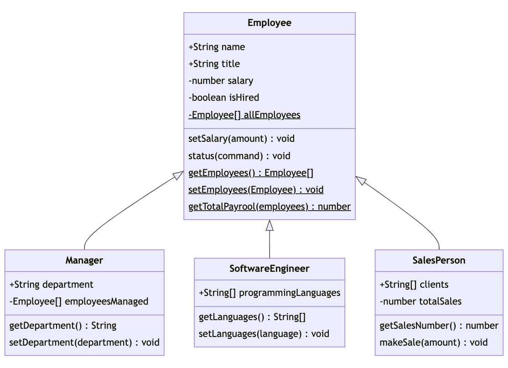

# Classy Coders Inc. 👩‍💻

In a tech-driven world, the importance of skilled employees cannot be overstated. Enter "Classy Coders Inc", a software development company on a mission to revolutionize the way businesses operate. As a budding developer, you've just landed a job at this esteemed establishment and are tasked with creating a series of classes that represents employees at the company and will underlie the systems they are building.

They have provided you with the following class diagram that represents their current workforce.



## `Employee`

Create a class `Employee` that has the following properties and methods:
- `name`: A string representing the name of the employee.
- `position`: A string representing the position of the employee.
- `salary`: A *private* number representing the salary of the employee.
- `isHired`: A *private* field that initializes with a value of `true`.
- `getSalary()`: A method that returns the `salary` of the employee.
- `setSalary(amount)`: A method that updates the `salary` of the employee.
- `getStatus()`: A method that returns the value of `isHired`.
- `setStatus(command)`: A method that updates `isHired` to:
    - `true` if `command` is `"hire"`
    - `false` if `command` is `"fire"`

### Examples
```javascript
const preston = new Employee("Preston", "Engineer", 100000);
preston.getSalary(); // 100000
preston.setSalary(105000);
preston.getSalary(); // 105000
preston.getStatus(); // true;
preston.setStatus("fire");
preston.getStatus(); // false;
```

## `Manager`

Create a subclass `Manager` that extends `Employee` (don't forget to import `Employee` to the `Manager.js` file!) and has the following additional property and methods:
- `department`: A string representing the department the manager is in charge of.
- `employeesManaged`: A *private* property that holds an array of `Employee` class instances the manager manages. Initializes as an empty array.
- `getEmployeesManaged()`: A method that returns the employees a manager has.
- `setEmployeesManaged(employee)`: A method that updates the `employeesManaged` with a new `Employee`

### Examples
```javascript
const jenna = new Manager("Jenna", "Head of Engineers", 120000, "Software Engineering", 10);
jenna.getEmployeesManaged(); // []
const preston = new Employee("Preston", "Engineer", 100000);
jenna.setEmployeesManaged(preston);
jenna.getEmployeesManaged(); // [ Employee ]
```

## `SoftwareEngineer`

Create a class of `SoftwareEngineer` that extends `Employee` and has the following additional properties and methods:
- `programmingLanguages`: A *private* property that holds an array of programming languages the software engineer knows.
- `getProgrammingLanguages()`: A method to return the `programmingLanguages` that the engineer knows.
- `setProgrammingLanguage(language)`: A method to update the `programmingLanguages` with a new language to the array.

### Examples
```javascript
const programmer = new SoftwareEngineer("Becca", "Senior Software Engineer", 100000, ["JavaScript", "Java", "Python"]);
programmer.getProgrammingLanguages(); // ["JavaScript", "Java", "Python"]
programmer.setProgrammingLanguage("C#"); 
programmer.getProgrammingLanguages(); // ["JavaScript", "Java", "Python", "C#"]
```
## `SalesPerson`

Create a class of `SalesPerson` that extends `Employee` and has the following additional properties and methods:
- `clients`: A property that holds an array of clients the salesperson manages.
- `totalSales`: A private field that contains the value of total sales the employee has performed. Initializes with a value of 0.
- `getSalesNumbers()`: A method that returns the `totalSales` for the salesperson.
- `makeSale(amount)`: A method that updates the `totalSales` with the `amount`.

### Examples

```javascript
const malik = new SalesPerson("Malik", "Enterprise Sale Associate", 90000, ["Vine", "MySpace", "Shutterfly"])
malik.getSalesNumbers(); // 0
malik.makeSale(10500);
malik.makeSale(20000);
malik.getSalesNumbers(); // 30500
```

## Updating `Employee` Class with Static Values
- `allEmployees`: A **private** static private property that initializes as an empty array. Every time a new `Employee` is created they are added to the end of this array.
- `getEmployees`: A static method that returns the array of `allEmployees`.
- `getTotalPayroll()`: A static method that returns the total salaries of all employees that are stored in the `allEmployees` array.

### Examples
```javascript
const jenna = new Manager("Jenna", "Head of Engineers", 120000, "Software Engineering", 10);
const programmer = new SoftwareEngineer("Becca", "Senior Software Engineer", 100000, ["JavaScript", "Java", "Python"]);
const malik = new SalesPerson("Malik", "Enterprise Sale Associate", 90000, ["Vine", "MySpace", "Shutterfly"])

Employees.getEmployees(); // [ Manager { }, SoftwareEngineer { }, SalesPerson { }]
Employees.getTotalSalary(); // 310000
```

## Stretch: Go Above and Beyond 🚀
1. **Error Handling**: Add error handling to the `setSalary` method of the Employee class. If the salary is less than `0`, throw an error with the message `"Salary cannot be negative"`.
2. **Search**: Create a `findClient(client)` method for the `SalesPerson` class. It should return the client that matches the argument provided.
3. **Promotions**: Add a `promote` method to the `Employee` class. This method should take in a new job title as an argument and update the employee's job title and salary accordingly. Implement this method in the `Manager` subclasses as well, as they may have additional promotion criteria.
4. **Performance Metrics**: Add performance metrics to the `Employee` class. Each employee should have a set of metrics such as sales numbers for salespeople, project completion rate for software engineers, and employee retention rate for managers. Implement a method to calculate and return the performance score based on these metrics. Design a method that use this score to determine bonuses and/or promotions.
